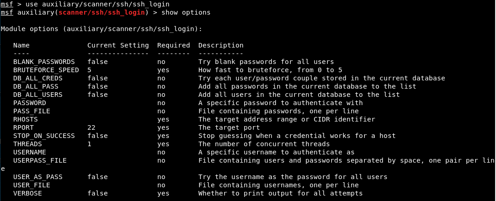
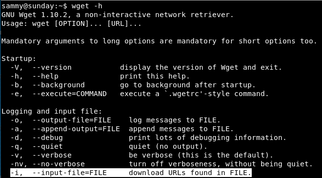

## SUNDAY
İlk olarak, kurban makinenin IP adresi ile **nmap** aracını kullanarak port taraması gerçekleştirildi.  Nmap aracına *-sS* parametresi eklenerek güncel servis taraması ve *-sV* parametresi eklenerek servis için güncel versiyon taraması yapıldı.

Resim 1 - Port Taraması

Çıkan sonuca göre ; 79,111 ve 22022 numaralı portların açık olduğu ve bu portların sırası ile; tcpwrapped, rpcbind ve SSH servisleri tarafından kullanıldığı tespit edildi.

Resim 2 - Açık Portlar ve Çalışan Servisler

SSH protokolü kullanılarak, sisteme erişilebileceği düşünüldü. Bunun için, metasploit aracı çalıştırıldı ve bir kelime listesinde bulunan kullanıcı adlarından yola çıkılarak, SSH kulanıcı adlarının bulunması için **ssh_enumusers** modülü seçildi. ssh_enumusers modülü, yolu belirtilen kullanıcı listesine göre, makinede bulunan kullanıcı adlarını bulmak amacı ile kullanılmaktadır.

Resim 3 - SSH Kullanıcı Adı Listeleme

Kurban makineye, kullanıcı adı listesi ile kullanıcı adı taraması yapmak adına, RHOSTS parametresi ile kurban makinenin IP adresi, RPORT parametresi ile SSH portu ve USER_FILE parametresi ile kullanılacak kelime listesi belirlendi.

Resim 4 - Parametre Değerleri

Tarama işlemi başlatıldı.

Resim 5 - Kullanıcı Adı Taraması

Yapılan tarama işlemi sonucuda, SSH protokolünü kullanarak sisteme giriş yapabilmek adına, 'root' ve 'sammy' kullanıcı isimleri bulundu.

Resim 6 - Bulunan Kullanıcı Adları

Kullanıcı ismi kullanılarak, kullanıcıya ait parolanın bulunabilmesi için, brute force yöntemi denemek adına, **ssh_login** modülü seçildi. ssh_login modülü, yolu belirtilen kullanıcı, parola veya kullanıcı-parola kelime listesine göre, ssh protokolünü kullanarak login denemesi yapmak amacı ile kullanılmkatadır.

Resim 7 - SSH_Login Modülü

Öncelikle 'root' kullanıcısına erişmek yerine, normal hak ve yetkilere sahip bir kullanıcı olduğu düşünülen 'sammy' kullanıcısı kullanılarak, brute force yöntemi gerçekleştirme işlemi tercih edildi. Bu nedenle USERNAME parametresine 'sammy' değeri atandı. Kurban makinenin IP adresi RHOSTS parametresi ile belirtildi. SSH protokolünün kullandığı port numarası '22022' olarak RPORT parametesi ile belirtildi. Bir metin listesine bağlı olarak parola deneneceği için, PASS_FILE parametresine popüler bir kelime listesi olan 'rockyou.txt' dosyasının yolu atandı.

Resim 8 - SSH_Login Modülü

Brute-Force başlatıldı.

Resim 9 - Parametre Değerleri

SSH protokü kullanılarak, 'sammy' kullanıcısıyla birlikte 'rockyou.txt' dosyasının her satırında bulunan kelimeler parola olarak denendi ve 'sammy' kullanıcısının parolası **'cooldude!'** olarak bulundu.

Resim 10 - Bulunan Parola, Kullanıcı ID Değeri ve Makine Bilgileri

**ssh sammy@10.10.10.76 -p 22022** komutu ile, kurban makineye bağlanma isteği gönderildi. Elde edilen parola girilerek makineye erişim sağlandı. **Desktop** dizinine gidilerek **user.txt** adlı dosya bulundu. **cat** komutu ile bu dosya okunarak, **Own User Flag** elde edildi.

Resim 11 - Own User Flag

Bu aşamadan sonra, hak yükseltme işlemi yapılması gerekmektedir. Bunun için **sudo -l** komutu çalıştırılarak, 'sudo' komutu ile yetkili kullanıcı parolası kullanılmadan hangi komutların çalıştırılabileceği listelendi. 'sudo' komutu yüksek hak ve yetkilere sahip bir kullanıcının hak ve yetkilerini kullanarak işlemler gerçekleştirmek adına kullanılır. Bir komut sudo ile birlikte çalıştırıdığında, yüksek hak ve yetkilere sahip kullanıcının parolası girilir ve komut çalıştırılır. Fakat sudo için verilen **NOPASSWD** izni ile, yüksek hak ve yetkilere sahip kullanıcının parolasına gerek kalmadan komut çalıştırılabilir. Resim 12'de görüldüğü üzere, 'sammy' kullanıcısı sudo ile birlikte **wget** komutunu kullanırsa, sistem tarafından parola istenmeyecektir. Bu durum, **Own System Flag**'e erişmek için bir yöntem olabilir.

Resim 12 - sudo Komutunu, Parolasız Kullanabilen Komutlar

wget komutunu işe yarayacak şekilde kullanabilmek adına, **wget -h** komutu ile wget'e ait bilgiler listelendi.

Resim 13 - wget komutu

Resim 13'te görülen **-i** parametresi işe yarayabilecek bir parametre olabilir. Çünkü, -i parametresi, wget komutu ile bağlantı kurulacak olan URL'leri, bir dosyadan satır satır çekmek amacı ile kullanılmaktadır. Eğer dosyanın bir satırında bulunan URL hatalı ise hatalı metin ile birlikte hata mesajı dönecektir. Bu nedenle **sudo wget -i /root/root.txt** komutu kullanılarak 'root.txt' dosyası içerisinde bulunan metin URL olarak wget'e verildi. Bu dosyada bulunan hash, bir URL olmadığı için, hata mesajı hash ile birlikte, yani **Own System Flag** geri bildirildi. Dolayısıyla Own System Flag elde edildi.

Resim 14 - Own System Flag

#### RAMİN KARIMKHANI
